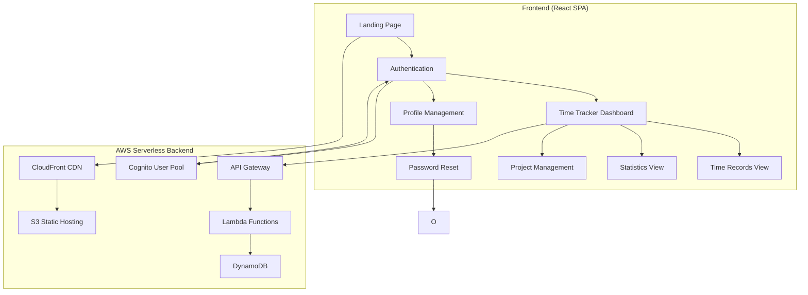

# Design Document: Time Tracking App

## Overview

The time tracking application will be built using a serverless-first architecture on AWS, following simplicity-first design principles and object-oriented programming practices. The frontend will be a React-based single-page application (SPA) with responsive design, while the backend will use AWS Lambda functions with DynamoDB for data persistence. Infrastructure and frontend will be maintained as separate deployable units for clear separation of concerns.

## Architecture

### High-Level Architecture



### Key Design Decisions

**Serverless-First Architecture**: Chosen for cost efficiency, automatic scaling, and reduced operational overhead. AWS Lambda functions scale automatically based on demand, and DynamoDB provides consistent performance without server management.

**Single-Page Application (SPA)**: React SPA provides a responsive user experience with client-side routing, reducing server requests and enabling offline functionality through service workers.

**Single-Table DynamoDB Design**: All data stored in one DynamoDB table with different partition/sort key patterns for efficient queries and cost optimization. This approach reduces complexity and improves performance for time-series data.

**AWS Cognito Integration**: Provides secure authentication with built-in email verification, password reset, and JWT token management, reducing custom authentication code and security risks.

**Independent Deployment Strategy**: Infrastructure and frontend can be deployed separately, allowing for faster iterations and reduced deployment risks.

### Technology Stack

**Frontend:**
- **React 18** with TypeScript for type safety
- **Vite** for fast development and building
- **Tailwind CSS** for responsive styling
- **React Router** for client-side routing
- **React Query (TanStack Query)** for server state management
- **React Hook Form** for form handling
- **Chart.js** with react-chartjs-2 for statistics visualization
- **PWA Configuration** with service worker for progressive web app functionality

**Backend:**
- **AWS Lambda** (Node.js 20) for serverless compute
- **AWS API Gateway** for REST API endpoints
- **AWS DynamoDB** for NoSQL data storage
- **AWS Cognito** for authentication and user management
- **AWS S3** for static website hosting
- **AWS CloudFront** for global CDN

**Development Tools:**
- **AWS CDK (Cloud Development Kit)** with TypeScript for infrastructure as code
- **Jest** and **React Testing Library** for basic unit testing
- **ESLint** and **Prettier** for code quality
- **GitHub Actions** for CI/CD workflows

## Components and Interfaces

### Frontend Components

#### 1. Landing Page Component
- **Purpose**: Public-facing page with app description and demo
- **Features**: Hero section, feature highlights, demo video/screenshots
- **Demo Functionality**: Interactive sample time tracking interface that shows functionality without allowing data modification
- **Responsive**: Mobile-first design with Tailwind breakpoints

#### 2. Authentication Components
- **LoginForm**: Integrates with AWS Cognito with email verification error handling
- **SignupForm**: User registration with email verification
- **ProtectedRoute**: HOC for authenticated route protection
- **ForgotPasswordPage**: Initiate password reset process with email input
- **PasswordResetPage**: Complete password reset with token validation from email links
- **ProfilePage**: User account management interface for personal information, password updates, and account deletion

#### 3. Time Tracking Components
- **TimeRecordForm**: Create/edit time records with auto-suggestion
- **TimeRecordList**: Display records in different views (daily/weekly/monthly)
- **ProjectAutocomplete**: Smart project suggestions with debounced search
- **TimerWidget**: Live timer for active time tracking with start/stop functionality
- **ActiveRecordDisplay**: Shows currently running record on dashboard in "Complete Time Record" view with editable fields
- **RecordFilters**: Filter controls for project and tag-based filtering across all views

#### 4. Statistics Components
- **StatsDashboard**: Overview of time tracking metrics
- **ProjectChart**: Pie/bar charts showing time distribution by project
- **TimelineChart**: Line chart showing daily/weekly patterns
- **MetricsCards**: Key performance indicators (total hours, avg daily, etc.)

### Backend API Endpoints

#### Authentication (AWS Cognito Integration)
- `POST /auth/login` - User authentication with email verification error handling
- `POST /auth/signup` - User registration
- `POST /auth/refresh` - Token refresh
- `POST /auth/logout` - User logout
- `POST /auth/forgot-password` - Initiate password reset
- `POST /auth/reset-password` - Complete password reset with token

#### Profile Management API
- `GET /api/profile` - Get user profile information
- `PUT /api/profile` - Update user personal information
- `PUT /api/profile/password` - Update user password
- `DELETE /api/profile` - Delete user profile and all associated data

#### Time Records API
- `GET /api/time-records` - List user's time records with filtering (supports project and tag filters)
- `POST /api/time-records` - Create new time record
- `PUT /api/time-records/{id}` - Update existing time record (including active records)
- `DELETE /api/time-records/{id}` - Delete time record
- `GET /api/time-records/stats` - Get aggregated statistics
- `POST /api/time-records/start` - Start a new active time record
- `PUT /api/time-records/stop/{id}` - Stop an active time record
- `GET /api/time-records/active` - Get user's currently active record
- `PUT /api/time-records/active/{id}` - Update active record fields while running

#### Projects API
- `GET /api/projects` - List user's projects
- `GET /api/projects/suggestions?q={query}` - Auto-suggestion endpoint

## Data Models

### DynamoDB Table Design

#### TimeRecords Table
```typescript
interface TimeRecord {
  PK: string;           // USER#{userId}
  SK: string;           // RECORD#{timestamp}#{recordId}
  GSI1PK: string;       // PROJECT#{projectName}
  GSI1SK: string;       // DATE#{date}
  recordId: string;     // UUID
  userId: string;       // Cognito user ID
  project: string;      // Project name (optional for active records)
  startTime: string;    // ISO 8601 timestamp
  endTime: string;      // ISO 8601 timestamp (null for active records)
  date: string;         // YYYY-MM-DD format
  duration: number;     // Duration in minutes (calculated when stopped)
  comment: string;      // User comment (optional)
  tags: string[];       // Array of tags (optional)
  isActive: boolean;    // True for currently running records
  createdAt: string;    // ISO 8601 timestamp
  updatedAt: string;    // ISO 8601 timestamp
}
```

#### Projects Table (Derived from TimeRecords)
```typescript
interface Project {
  PK: string;           // USER#{userId}
  SK: string;           // PROJECT#{projectName}
  projectName: string;  // Project name
  lastUsed: string;     // ISO 8601 timestamp
  totalRecords: number; // Count of records
  totalDuration: number; // Total minutes tracked
}
```

### DynamoDB Access Patterns

1. **Get user's time records by date range**: Query PK = USER#{userId}, SK between dates
2. **Get records by project**: Query GSI1PK = PROJECT#{projectName}
3. **Get project suggestions**: Query PK = USER#{userId}, SK begins_with PROJECT#
4. **Get statistics**: Aggregate queries using DynamoDB streams or Lambda
5. **Get active record**: Query PK = USER#{userId} with filter isActive = true
6. **Ensure single active record**: Check for existing active records before starting new ones
7. **Filter records by project**: Query PK = USER#{userId} with GSI1PK filter for specific project
8. **Filter records by tags**: Query PK = USER#{userId} with filter expression on tags array
9. **Profile deletion cascade**: Delete all records with PK = USER#{userId} when user deletes profile

## Error Handling

### Frontend Error Handling
- **Network Errors**: Retry logic with exponential backoff
- **Authentication Errors**: Automatic token refresh, redirect to login, email verification error messages
- **Validation Errors**: Real-time form validation with user-friendly messages
- **Loading States**: Skeleton screens and loading indicators

### Backend Error Handling
- **Lambda Error Responses**: Standardized error format with HTTP status codes
- **DynamoDB Errors**: Retry logic for throttling, graceful degradation
- **Cognito Errors**: Proper error mapping for authentication failures
- **Input Validation**: Joi or Zod schema validation for all endpoints

## Correctness Properties

*A property is a characteristic or behavior that should hold true across all valid executions of a system—essentially, a formal statement about what the system should do. Properties serve as the bridge between human-readable specifications and machine-verifiable correctness guarantees.*

### Core System Properties

**Property 1: Data Isolation and Access Control**
*For any* authenticated user, they should only be able to access, view, and modify their own time records and never see data belonging to other users
**Validates: Requirements 1.6, 7.2**

**Property 2: Time Record Validation**
*For any* time record creation or update attempt, the system should validate that all required fields (project, start time, end time, date, comment, tags) are present and that end time is after start time
**Validates: Requirements 2.1, 2.3**

**Property 3: Data Persistence Round-Trip**
*For any* valid time record, saving it to the system and then retrieving it should return the same data with all fields intact
**Validates: Requirements 2.4, 7.1, 7.3**

**Property 4: Project Auto-Suggestion Filtering**
*For any* search query in the project field, all returned suggestions should contain the query text and come only from the user's existing projects
**Validates: Requirements 2.2, 3.1, 3.4**

**Property 5: Project Selection and Storage**
*For any* selected project suggestion, the project field should be populated with that exact value, and any new project name should be stored for future suggestions
**Validates: Requirements 3.2, 3.3**

**Property 6: Suggestion Prioritization**
*For any* set of matching project suggestions, recently used projects should appear before older ones in the suggestion list
**Validates: Requirements 3.5**

**Property 7: CRUD Operations Completeness**
*For any* time record owned by a user, they should be able to edit its fields and delete it completely from the system
**Validates: Requirements 2.5, 2.6**

**Property 8: Date-Based View Filtering**
*For any* selected date range (daily, weekly, monthly), the system should display only time records that fall within that range, properly grouped by the requested time period
**Validates: Requirements 4.1, 4.2, 4.3**

**Property 9: View State Persistence**
*For any* view navigation (switching between daily/weekly/monthly), the user's selected date range and context should be maintained across view changes
**Validates: Requirements 4.4**

**Property 10: Complete Record Display**
*For any* displayed time record, all required fields (project, duration, tags, comments) should be visible in the interface
**Validates: Requirements 4.5**

**Property 11: Statistics Calculation Accuracy**
*For any* set of time records, calculated statistics (project totals, tag totals, daily/weekly/monthly totals, averages) should accurately reflect the sum and average of the underlying data
**Validates: Requirements 5.1, 5.2, 5.3, 5.5**

**Property 12: Cross-Device Functionality**
*For any* core time tracking operation (create, read, update, delete records), the functionality should work consistently across different device viewport sizes
**Validates: Requirements 6.5**

**Property 13: UI Refresh After Data Changes**
*For any* time record creation, update, or deletion, the current view should refresh to display the updated data immediately
**Validates: Requirements 2.8**

**Property 14: Single Active Record Constraint**
*For any* user, there should be at most one active (running) time record at any given time
**Validates: Requirements 8.3**

**Property 15: Active Record Display and Editing**
*For any* user with a running time record, the dashboard should prominently display the active record in a "Complete Time Record" view with all fields editable except end time
**Validates: Requirements 8.4, 8.5**

**Property 16: Timer Start Without Input**
*For any* user starting a new time record from the dashboard, no input fields should be required to begin tracking
**Validates: Requirements 8.1, 8.2**

**Property 17: Active Record Start Time Modification**
*For any* active time record, the user should be able to update the start time to any past timestamp while the timer is running
**Validates: Requirements 8.6**

**Property 18: Timer Stop Completion**
*For any* active time record being stopped, the system should save the record with all field values that were provided during the active session
**Validates: Requirements 8.7, 8.8**

**Property 19: Email Verification Error Display**
*For any* login attempt with an unverified email address, the system should display a clear error message indicating email verification is required
**Validates: Requirements 1.5**

**Property 21: Profile Management Functionality**
*For any* authenticated user on the profile page, they should be able to view and update their personal information, change their password, and delete their profile
**Validates: Requirements 1.10, 1.11, 1.12, 1.13**

**Property 22: Password Reset Email Flow**
*For any* user requesting password reset, the system should send a secure reset link to their email and allow password change only with valid token
**Validates: Requirements 1.7, 1.8, 1.9**

**Property 23: Profile Deletion Data Cleanup**
*For any* user deleting their profile, all associated time records should be permanently removed from the system
**Validates: Requirements 1.14**

**Property 24: Landing Page Demo Functionality**
*For any* unauthenticated user viewing the landing page, they should see sample time tracking functionality without the ability to modify data
**Validates: Requirements 1.1, 1.2**

**Property 25: Progressive Web App Mobile Adaptation**
*For any* user opening the application on a smartphone as a progressive web app, the UI layout should adapt automatically for mobile optimization
**Validates: Requirements 6.6**

## Testing Strategy

### Simplified Testing Approach

Following the project's simplicity-first principle, the application will use a focused testing strategy:

**Basic Unit Testing:**
- **Jest** with **React Testing Library** for component tests
- Focus on critical business logic and core functionality only
- Avoid over-testing to maintain development velocity
- Target essential user flows and data validation

### Testing Framework Configuration

**Frontend Testing:**
- **Jest** with **React Testing Library** for unit tests
- **Cypress** for essential end-to-end testing
- Focus on critical paths: authentication, time record CRUD, basic statistics

**Backend Testing:**
- **Jest** for Lambda function unit tests
- **AWS CDK** unit tests for infrastructure validation
- **DynamoDB Local** for database testing during development

### Test Coverage Requirements

- **Unit Test Coverage**: Focus on critical business logic only
- **Integration Test Coverage**: Essential API endpoints and authentication flows
- **E2E Test Coverage**: Core user journeys (signup, login, create/edit/delete records)

## Deployment and Infrastructure

### AWS Serverless Architecture

**Infrastructure as Code:**
- **AWS CDK** with TypeScript for all AWS resources
- **CloudFormation** for stack management (generated by CDK)
- **GitHub Actions** for CI/CD pipeline
- **Separate Infrastructure Deployment**: Infrastructure changes deployable independently from frontend

**Cost Optimization:**
- **AWS Free Tier** utilization for DynamoDB, Lambda, S3, CloudFront
- **On-demand billing** for Lambda functions
- **DynamoDB on-demand** pricing for variable workloads
- **S3 Standard-IA** for infrequent access patterns

**Security:**
- **AWS Cognito** for secure authentication
- **API Gateway** with request validation
- **Lambda function** environment variables for secrets
- **CloudFront** with HTTPS enforcement
- **DynamoDB** encryption at rest

### Development Workflow

1. **Local Development**: 
   - Frontend: React development server with npm version 10.2.4 compatibility
   - Backend: AWS CDK local testing with DynamoDB Local
   - **CORS Configuration**: Proper CORS handling for local development
   - **Startup Scripts**: Platform-specific scripts for consistent local development
2. **Testing**: Focused unit tests for critical business logic
3. **Staging**: Deploy infrastructure and frontend independently to AWS staging environment
4. **Production**: Blue/green deployment with CloudFormation via CDK

### CI/CD Pipeline Design

**Automated Deployment Strategy:**
- **GitHub Actions** for continuous integration and deployment
- **Branch-based Deployments**: Main branch deploys to production, pull requests deploy to development environment
- **Deployment Order**: Infrastructure and backend deployed first, followed by frontend deployment
- **Independent Deployments**: Infrastructure changes can be deployed separately from frontend changes
- **Environment Isolation**: Separate AWS environments for development and production

**Deployment Sequence:**
1. **Infrastructure First**: Deploy AWS CDK stack with Lambda functions, DynamoDB, API Gateway
2. **Frontend Second**: Deploy React application to S3 and invalidate CloudFront cache
3. **Validation**: Automated health checks to ensure successful deployment

## Performance Considerations

### Frontend Optimization
- **Code Splitting**: Route-based lazy loading with React.lazy()
- **Bundle Optimization**: Tree shaking with Vite
- **Caching**: Service worker for offline functionality
- **Image Optimization**: WebP format with fallbacks

### Backend Optimization
- **Lambda Cold Start**: Provisioned concurrency for critical functions
- **DynamoDB**: Single-table design for efficient queries
- **API Gateway**: Response caching for read-heavy operations with proper CORS configuration
- **CloudFront**: Global edge caching for static assets

### Scalability
- **Auto-scaling**: Lambda functions scale automatically
- **Database**: DynamoDB on-demand scaling
- **CDN**: CloudFront global distribution
- **Monitoring**: CloudWatch metrics and alarms