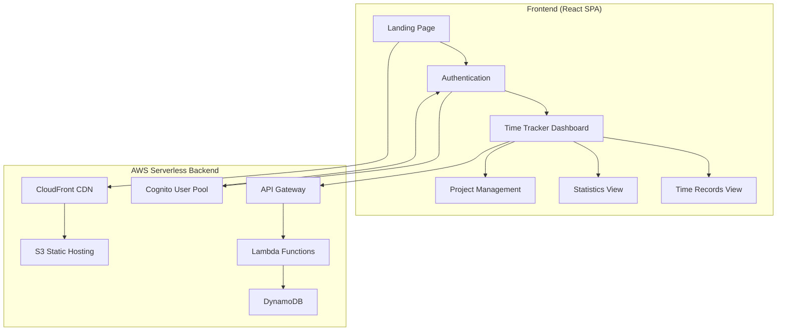

# Design Document: Time Tracking App

## Overview

The time tracking application will be built using a serverless-first architecture on AWS, leveraging open source frameworks and free-tier services to minimize costs while maintaining scalability. The frontend will be a React-based single-page application (SPA) with responsive design, while the backend will use AWS Lambda functions with DynamoDB for data persistence.

## Architecture

### High-Level Architecture



### Technology Stack

**Frontend:**
- **React 18** with TypeScript for type safety
- **Vite** for fast development and building
- **Tailwind CSS** for responsive styling
- **React Router** for client-side routing
- **React Query (TanStack Query)** for server state management
- **React Hook Form** for form handling
- **Chart.js** with react-chartjs-2 for statistics visualization

**Backend:**
- **AWS Lambda** (Node.js 18) for serverless compute
- **AWS API Gateway** for REST API endpoints
- **AWS DynamoDB** for NoSQL data storage
- **AWS Cognito** for authentication and user management
- **AWS S3** for static website hosting
- **AWS CloudFront** for global CDN

**Development Tools:**
- **AWS SAM (Serverless Application Model)** for infrastructure as code
- **Jest** and **React Testing Library** for testing
- **ESLint** and **Prettier** for code quality

## Components and Interfaces

### Frontend Components

#### 1. Landing Page Component
- **Purpose**: Public-facing page with app description and demo
- **Features**: Hero section, feature highlights, demo video/screenshots
- **Responsive**: Mobile-first design with Tailwind breakpoints

#### 2. Authentication Components
- **LoginForm**: Integrates with AWS Cognito
- **SignupForm**: User registration with email verification
- **ProtectedRoute**: HOC for authenticated route protection

#### 3. Time Tracking Components
- **TimeRecordForm**: Create/edit time records with auto-suggestion
- **TimeRecordList**: Display records in different views (daily/weekly/monthly)
- **ProjectAutocomplete**: Smart project suggestions with debounced search
- **TimerWidget**: Optional live timer for active time tracking

#### 4. Statistics Components
- **StatsDashboard**: Overview of time tracking metrics
- **ProjectChart**: Pie/bar charts showing time distribution by project
- **TimelineChart**: Line chart showing daily/weekly patterns
- **MetricsCards**: Key performance indicators (total hours, avg daily, etc.)

### Backend API Endpoints

#### Authentication (AWS Cognito Integration)
- `POST /auth/login` - User authentication
- `POST /auth/signup` - User registration
- `POST /auth/refresh` - Token refresh
- `POST /auth/logout` - User logout

#### Time Records API
- `GET /api/time-records` - List user's time records with filtering
- `POST /api/time-records` - Create new time record
- `PUT /api/time-records/{id}` - Update existing time record
- `DELETE /api/time-records/{id}` - Delete time record
- `GET /api/time-records/stats` - Get aggregated statistics

#### Projects API
- `GET /api/projects` - List user's projects
- `GET /api/projects/suggestions?q={query}` - Auto-suggestion endpoint

## Data Models

### DynamoDB Table Design

#### TimeRecords Table
```typescript
interface TimeRecord {
  PK: string;           // USER#{userId}
  SK: string;           // RECORD#{timestamp}#{recordId}
  GSI1PK: string;       // PROJECT#{projectName}
  GSI1SK: string;       // DATE#{date}
  recordId: string;     // UUID
  userId: string;       // Cognito user ID
  project: string;      // Project name
  startTime: string;    // ISO 8601 timestamp
  endTime: string;      // ISO 8601 timestamp
  date: string;         // YYYY-MM-DD format
  duration: number;     // Duration in minutes
  comment: string;      // User comment
  tags: string[];       // Array of tags
  createdAt: string;    // ISO 8601 timestamp
  updatedAt: string;    // ISO 8601 timestamp
}
```

#### Projects Table (Derived from TimeRecords)
```typescript
interface Project {
  PK: string;           // USER#{userId}
  SK: string;           // PROJECT#{projectName}
  projectName: string;  // Project name
  lastUsed: string;     // ISO 8601 timestamp
  totalRecords: number; // Count of records
  totalDuration: number; // Total minutes tracked
}
```

### DynamoDB Access Patterns

1. **Get user's time records by date range**: Query PK = USER#{userId}, SK between dates
2. **Get records by project**: Query GSI1PK = PROJECT#{projectName}
3. **Get project suggestions**: Query PK = USER#{userId}, SK begins_with PROJECT#
4. **Get statistics**: Aggregate queries using DynamoDB streams or Lambda

## Error Handling

### Frontend Error Handling
- **Network Errors**: Retry logic with exponential backoff
- **Authentication Errors**: Automatic token refresh, redirect to login
- **Validation Errors**: Real-time form validation with user-friendly messages
- **Loading States**: Skeleton screens and loading indicators

### Backend Error Handling
- **Lambda Error Responses**: Standardized error format with HTTP status codes
- **DynamoDB Errors**: Retry logic for throttling, graceful degradation
- **Cognito Errors**: Proper error mapping for authentication failures
- **Input Validation**: Joi or Zod schema validation for all endpoints

## Correctness Properties

*A property is a characteristic or behavior that should hold true across all valid executions of a system—essentially, a formal statement about what the system should do. Properties serve as the bridge between human-readable specifications and machine-verifiable correctness guarantees.*

### Core System Properties

**Property 1: Data Isolation and Access Control**
*For any* authenticated user, they should only be able to access, view, and modify their own time records and never see data belonging to other users
**Validates: Requirements 1.5, 7.2**

**Property 2: Time Record Validation**
*For any* time record creation or update attempt, the system should validate that all required fields (project, start time, end time, date, comment, tags) are present and that end time is after start time
**Validates: Requirements 2.1, 2.3**

**Property 3: Data Persistence Round-Trip**
*For any* valid time record, saving it to the system and then retrieving it should return the same data with all fields intact
**Validates: Requirements 2.4, 7.1, 7.3**

**Property 4: Project Auto-Suggestion Filtering**
*For any* search query in the project field, all returned suggestions should contain the query text and come only from the user's existing projects
**Validates: Requirements 2.2, 3.1, 3.4**

**Property 5: Project Selection and Storage**
*For any* selected project suggestion, the project field should be populated with that exact value, and any new project name should be stored for future suggestions
**Validates: Requirements 3.2, 3.3**

**Property 6: Suggestion Prioritization**
*For any* set of matching project suggestions, recently used projects should appear before older ones in the suggestion list
**Validates: Requirements 3.5**

**Property 7: CRUD Operations Completeness**
*For any* time record owned by a user, they should be able to edit its fields and delete it completely from the system
**Validates: Requirements 2.5, 2.6**

**Property 8: Date-Based View Filtering**
*For any* selected date range (daily, weekly, monthly), the system should display only time records that fall within that range, properly grouped by the requested time period
**Validates: Requirements 4.1, 4.2, 4.3**

**Property 9: View State Persistence**
*For any* view navigation (switching between daily/weekly/monthly), the user's selected date range and context should be maintained across view changes
**Validates: Requirements 4.4**

**Property 10: Complete Record Display**
*For any* displayed time record, all required fields (project, duration, tags, comments) should be visible in the interface
**Validates: Requirements 4.5**

**Property 11: Statistics Calculation Accuracy**
*For any* set of time records, calculated statistics (project totals, tag totals, daily/weekly/monthly totals, averages) should accurately reflect the sum and average of the underlying data
**Validates: Requirements 5.1, 5.2, 5.3, 5.5**

**Property 12: Cross-Device Functionality**
*For any* core time tracking operation (create, read, update, delete records), the functionality should work consistently across different device viewport sizes
**Validates: Requirements 6.5**

## Testing Strategy

<function_calls>
<invoke name="prework">
<parameter name="featureName">time-tracking-app
### Dual Testing Approach

The application will use both unit tests and property-based tests to ensure comprehensive coverage:

**Unit Tests:**
- Specific examples and edge cases for individual components
- Integration tests for authentication flows
- UI component rendering tests
- API endpoint response validation
- Error handling scenarios

**Property-Based Tests:**
- Universal properties that hold across all valid inputs
- Data validation and persistence properties
- Business logic correctness across random inputs
- Cross-browser and cross-device functionality

### Testing Framework Configuration

**Frontend Testing:**
- **Jest** with **React Testing Library** for unit tests
- **fast-check** for property-based testing in JavaScript/TypeScript
- **Cypress** for end-to-end testing
- Each property test configured to run minimum 100 iterations
- Property tests tagged with format: **Feature: time-tracking-app, Property {number}: {property_text}**

**Backend Testing:**
- **Jest** for Lambda function unit tests
- **fast-check** for property-based testing of business logic
- **AWS SAM Local** for integration testing
- **DynamoDB Local** for database testing
- Each property test references its corresponding design document property

### Test Coverage Requirements

- **Unit Test Coverage**: Minimum 80% code coverage for critical paths
- **Property Test Coverage**: All 12 correctness properties must be implemented as property-based tests
- **Integration Test Coverage**: All API endpoints and authentication flows
- **E2E Test Coverage**: Critical user journeys (signup, login, create/edit/delete records, view statistics)

## Deployment and Infrastructure

### AWS Serverless Architecture

**Infrastructure as Code:**
- **AWS SAM** templates for all AWS resources
- **CloudFormation** for stack management
- **GitHub Actions** for CI/CD pipeline

**Cost Optimization:**
- **AWS Free Tier** utilization for DynamoDB, Lambda, S3, CloudFront
- **On-demand billing** for Lambda functions
- **DynamoDB on-demand** pricing for variable workloads
- **S3 Standard-IA** for infrequent access patterns

**Security:**
- **AWS Cognito** for secure authentication
- **API Gateway** with request validation
- **Lambda function** environment variables for secrets
- **CloudFront** with HTTPS enforcement
- **DynamoDB** encryption at rest

### Development Workflow

1. **Local Development**: AWS SAM Local + DynamoDB Local
2. **Testing**: Automated test suite with property-based tests
3. **Staging**: Deploy to AWS staging environment
4. **Production**: Blue/green deployment with CloudFormation

## Performance Considerations

### Frontend Optimization
- **Code Splitting**: Route-based lazy loading with React.lazy()
- **Bundle Optimization**: Tree shaking with Vite
- **Caching**: Service worker for offline functionality
- **Image Optimization**: WebP format with fallbacks

### Backend Optimization
- **Lambda Cold Start**: Provisioned concurrency for critical functions
- **DynamoDB**: Single-table design for efficient queries
- **API Gateway**: Response caching for read-heavy operations
- **CloudFront**: Global edge caching for static assets

### Scalability
- **Auto-scaling**: Lambda functions scale automatically
- **Database**: DynamoDB on-demand scaling
- **CDN**: CloudFront global distribution
- **Monitoring**: CloudWatch metrics and alarms